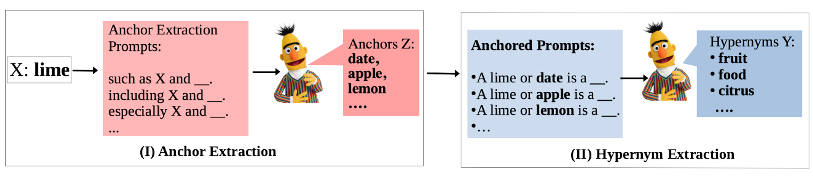

# Anchored Prompts 

This repository contains the data and code for constructing anchored prompts for hypernym extraction from BERT. 
This is based on our paper accepted by *SEM 2023. 

## Citations

```
@inproceedings{liu-etal-2023-anchored-prompts,
    title = "Seeking Clozure Robust Hypernym Extraction from BERT with Anchored Prompts",
    author = "Chunhua Liu  and
              Trevor Cohn  and
              Lea Frermann",
    booktitle = "*SEM 2023",
    month = jul,
    year = "2023",
    publisher = "Association for Computational Linguistics"
}
```

**Links**:
[paper](paper/WAX__A_novel_dataset_for_Word_Association_eXplanations.pdf)
[poster](paper/StartSEM23_Anchored_Prompts_Poster_A0.pdf)
[slides](papter/Anchored_Prompts_37.pptx)

## Introduction 
The automatic extraction of hypernym knowledge from large language models like BERT is an open problem, and it is unclear whether methods fail due to a lack of knowledge in the model or shortcomings of the extraction methods. **In particular, methods fail on challenging cases which include rare or abstract concepts, and perform inconsistently under paraphrased prompts**. 

In this study, we revisit the long line of work on pattern-based hypernym extraction, and use it as a diagnostic tool to thoroughly examine the hypernomy knowledge encoded in BERT and the limitations of hypernym extraction methods. We propose to construct prompts from established pattern structures: definitional (X is a Y); lexico-syntactic (Y such as X); and their anchored versions (Y such as X or Z). 

We devise an automatic method (Figure 1) for anchor prediction, and compare different patterns in: 
- (i) their effectiveness for hypernym retrieval from BERT across six English data sets;
- (ii) on challenge sets of rare and abstract concepts;
- (iii) on consistency under paraphrasing.
  
We show that **anchoring is particularly useful for abstract concepts and in enhancing consistency across paraphrases, demonstrating how established methods in the field can inform prompt engineering.** 

<!--  -->

<p align = "center">

</p>
<p align = "center" style="font-family:liberation sans">
Figure 1: Our framework for constructing anchored prompts and hypernym extraction. 
</p>
 
# Repository Structure 

## Anchor Extraction and Hypernym Extraction 
Here is the main code for extracting anchors and hypernyms. 
All dataset is included in the `./data` folder. Here we use the `BLESS` as an exmple to illustrate the main relevant files . 


You can run one dataset with the following example command: 
```
python -u anchored_prompts.py --config_file/hypernymsuite/BLESS.yaml 
``` 
-- `anchored_prompts.py` is the main python file 
-- `config_file` contains the hyperparameters such as the dataset name, data path, pre-trained language model and number of anchors 


## Anchor Validation
`pre_post_process/script/anchor_evaluation_wordnet.ipynb` contains the anchor evaluation using WordNet siblings.


## Analysis 
To understand whether anchored prompts can tackle the challenge situations faced in non-anchored prompts, we conducted three analysis to compare them. 
### Frequency 

`pre_post_process/script/result_analysis_frequency.ipynb` contains our frequency analysis. 
### Abstractness 
`pre_post_process/script/result_analysis_concreteness.ipynb` contains our analysis on concept abstractness. 

###  Consistency 
We conduct two consistency test, including (1) consistency on a pair of singular and plural prompts (2) consistency across a group prompts. 

#### Pairwise 
`python -u consistency_check.py  'data/hypernymsuite/BLESS/consistency/' False`

#### Group 
`python -u consistency_check_group.py  'data/hypernymsuite/BLESS/singular/consistency_group/' False`


## Contact

Feel free to contact chunhua[dot]liu[at]student.unimelb.edu.au if you have any feedback. 
